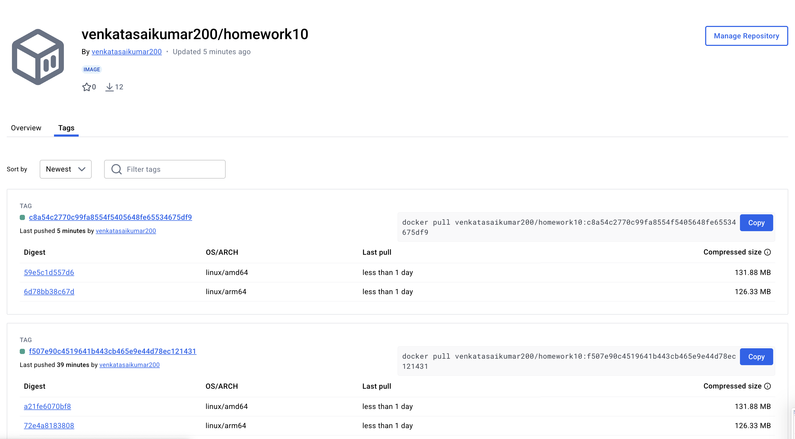
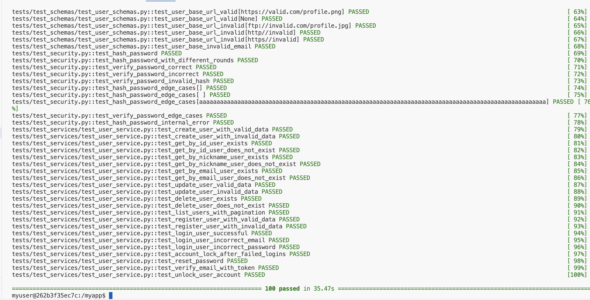

# Event Manager Company: Software QA Analyst/Developer Onboarding Assignment

Welcome to my submission for the Event Manager Company onboarding assignment as a Software QA Analyst/Developer. This repository reflects my hands-on work with API development, validation, testing, and Docker deployment. The REST API is running successfully with proper documentation, automated testing, and secure JWT-based authentication.

---

## ✅ Application Setup

- API documentation accessible at: **http://localhost/docs**
- PostgreSQL management via PGAdmin at: **http://localhost:5050**
- Docker setup complete with successful container builds and service orchestration.

### 🐳 Docker Compose Up

---

## ✅ Test Results

The application passed all test cases and achieved **94% test coverage**.

### ✅ All Tests Passing

---

## 🔍 Issues Addressed

I identified, resolved, and documented 7 issues. Each issue includes code changes and test cases.

| # | Issue Title | Status | Issue Link |
|---|-------------|--------|------------|
| 1 | [Failing tests due to missing token fixtures and email service disconnection](https://github.com/Venkatasaikumarkethala/homework10/issues/1) | ✅ Closed |
| 2 | [Critical and High Trivy vulnerabilities in dependencies](https://github.com/Venkatasaikumarkethala/homework10/issues/3) | ✅ Closed |
| 3 | [Username validation allows invalid characters or lengths](https://github.com/Venkatasaikumarkethala/homework10/issues/5) | ✅ Closed |
| 4 | [user_schema – Validation and Type Issues Causing Test Failures](https://github.com/Venkatasaikumarkethala/homework10/issues/7) | ✅ Closed |
| 5 | [Validation Failures and Schema Mismatches in UserCreate, UserResponse, and Related Tests](https://github.com/Venkatasaikumarkethala/homework10/issues/9) | ✅ Closed |
| 6 | [Profile picture URL should end with valid image format](https://github.com/Venkatasaikumarkethala/homework10/issues/13) | ✅ Closed |
| 7 | [Password Validation](https://github.com/Venkatasaikumarkethala/homework10/issues/15) | ✅ Closed |

---

## 🧪 Testing and Coverage

- Manual and automated tests written using `pytest`
- Edge case testing on bio and profile picture fields
- Password and username validation rules tested with both valid and invalid cases

---

## 📦 Dockerhub Deployment

The Docker image for the project is available at:

👉 [Dockerhub - homework10](https://hub.docker.com/repository/docker/venkatasaikumar200/homework10/general)

---

## ✨ Reflection

This assignment helped me solidify my skills in RESTful API development and software quality assurance. I learned how to:
- Debug deep issues in model-schema alignment
- Enforce best practices in password and username validation
- Write thorough automated test cases to push coverage over 90%
- Collaborate using GitHub effectively through issues, branches, and PRs
- Deploy and manage containerized services with Docker

The real-world simulation of issues, fixes, and peer review workflows was a valuable learning experience and a great confidence booster.

---